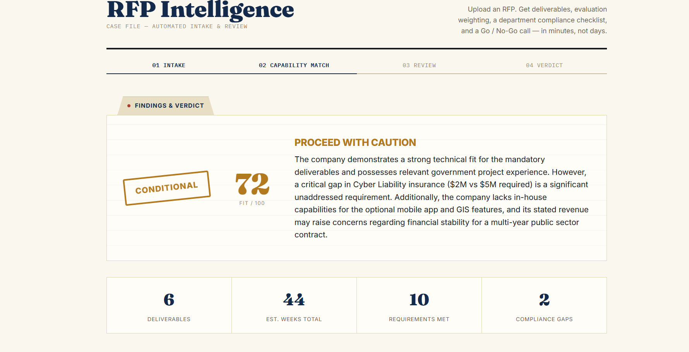
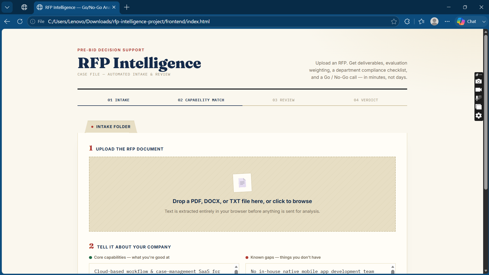
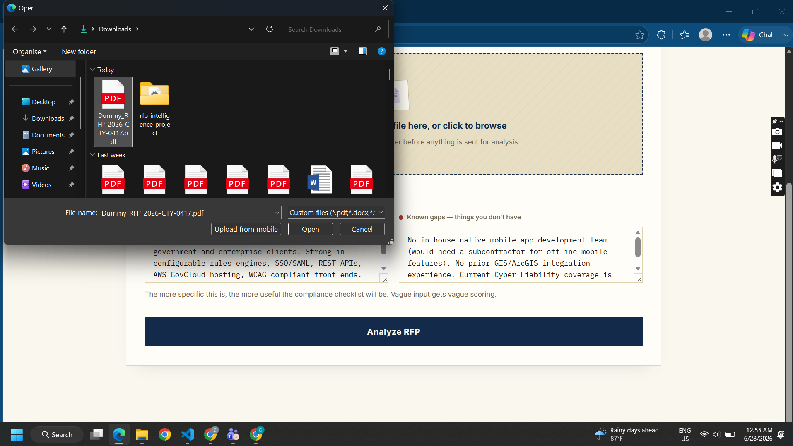
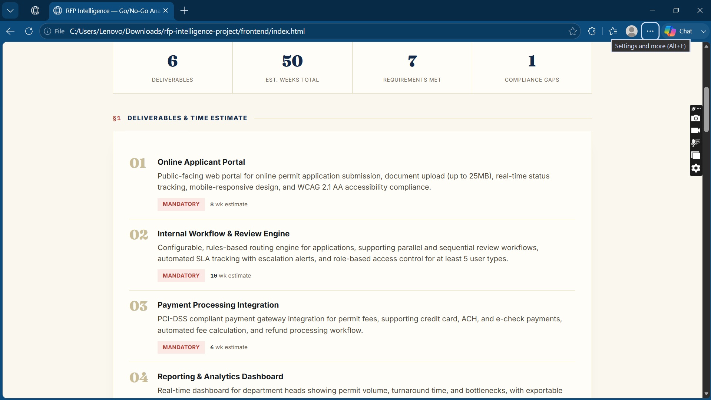
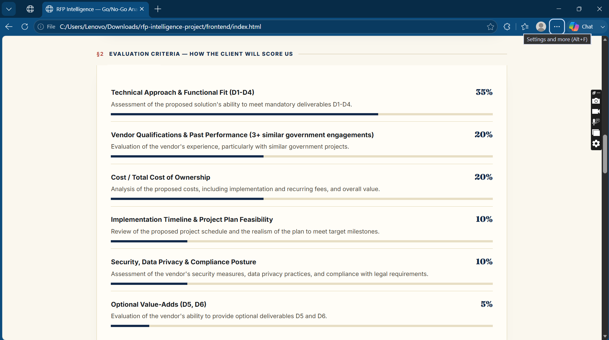
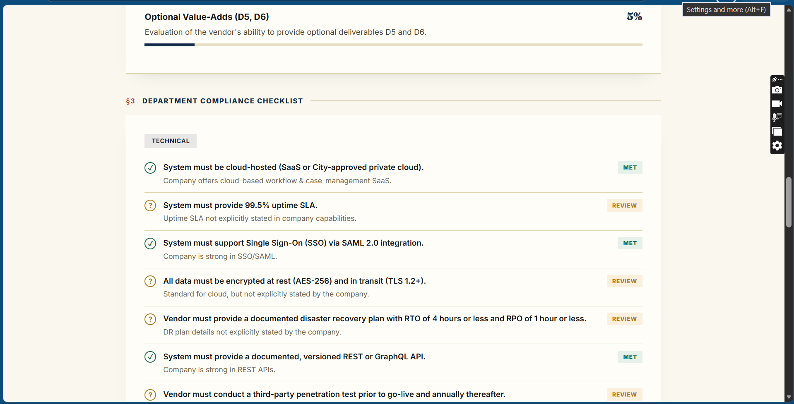
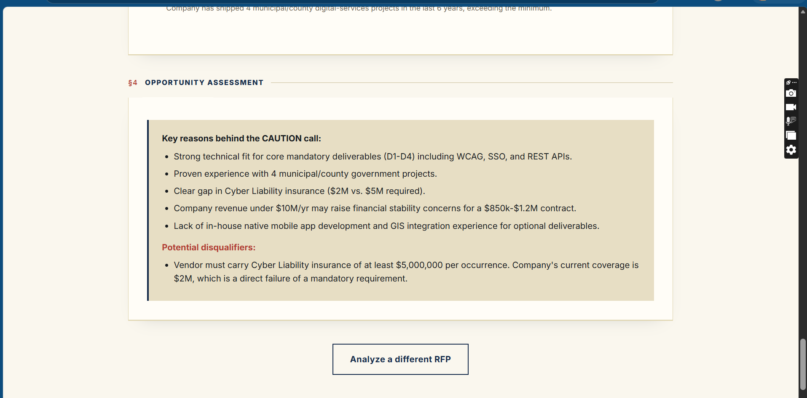

#  RFP Intelligence — AI-Powered Go/No-Go Analyzer

> Upload an RFP. Get deliverables, evaluation weights, a department compliance checklist, and a Go / No-Go recommendation — in minutes, not days.



---

##  What It Does

Companies waste hours manually reading government and enterprise RFPs before deciding whether to bid. **RFP Intelligence** automates that pre-bid review:

| Step | What Happens |
|------|-------------|
| Upload | Drop a PDF, DOCX, or TXT RFP — text is extracted entirely in your browser |
| Profile | Describe your company's strengths and known gaps in two text boxes |
| Analyze | Gemini AI reads the RFP against your profile and returns structured JSON |
| Results | View deliverables + time estimates, evaluation criteria weights, a compliance checklist, and a scored verdict |

---

##  Screenshots

<details>
<summary>Click to expand all screenshots</summary>

**Upload & Company Profile**



**Findings & Verdict (72/100 — Conditional)**


**Deliverables & Time Estimates**


**Evaluation Criteria Weights**


**Department Compliance Checklist**


**Opportunity Assessment**


</details>

---

##  Architecture

```
rfp-intelligence/
├── frontend/
│   └── index.html          ← Single-file app (HTML + CSS + JS, no build step)
├── backend/
│   ├── server.js           ← Node/Express proxy — holds the API key securely
│   ├── package.json
│   └── .env.example        ← Copy this to .env and add your key
├── tools/
│   └── generate_rfp.js     ← Script used to generate the dummy test RFP
├── Dummy_RFP_2026-CTY-0417.pdf   ← Sample RFP for testing
└── README.md
```

**Why a backend at all?**
The Gemini API key must never sit in browser-side code — anyone can open DevTools and steal it from page source or network requests. The backend holds the key in a `.env` file and the frontend only ever talks to *your* backend, never to Google directly.

**Data flow:**
```
Browser (PDF/DOCX parsing) → POST extracted text → Express backend → Gemini API → JSON → Frontend renders
```

No raw document bytes ever leave your machine. Only extracted plain text is sent.

---

##  Quick Start

### Prerequisites
- Node.js 18+
- A free Gemini API key → [Get one here](https://aistudio.google.com/apikey)

### 1. Clone & install
```bash
git clone https://github.com/YOUR_USERNAME/rfp-intelligence.git
cd rfp-intelligence/backend
npm install
```

### 2. Configure the API key
```bash
cp .env.example .env
```
Open `.env` and paste your key:
```
GEMINI_API_KEY=your_real_key_here
```

### 3. Start the backend
```bash
npm start
# → RFP Intelligence backend running on http://localhost:3001
```

Verify it's alive: open [http://localhost:3001/api/health](http://localhost:3001/api/health) — should return `{"status":"ok"}`.

### 4. Open the frontend
```bash
# Just open in browser directly:
open ../frontend/index.html

# OR serve it locally:
npx serve ../frontend
```

### 5. Test it
1. Upload `Dummy_RFP_2026-CTY-0417.pdf` (included in the repo).
2. The company profile text boxes are pre-filled with a sample vendor profile.
3. Click **Analyze RFP** and watch the results populate across all four tabs.

---

##  Output Sections

### § 1 — Deliverables & Time Estimate
Each deliverable extracted from the RFP with:
- Mandatory vs Optional flag
- Realistic week estimate based on described scope

### § 2 — Evaluation Criteria
How the client will score your proposal — category name, weight %, and description (e.g. *Technical Approach 35%, Vendor Qualifications 20%*).

### § 3 — Department Compliance Checklist
Requirements grouped by department with status badges:

| Badge | Meaning |
|-------|---------|
|  **MET** | Your stated strengths clearly satisfy this requirement |
|  **REVIEW** | Cannot confirm from your profile — human review needed |
|  **GAP** | Your stated gaps directly conflict with this requirement |

Departments covered: **Technical · Legal · Accounting · Operations**

### § 4 — Verdict
- **GO / CAUTION / NO-GO** stamp
- **Fit Score** out of 100
- Key reasons summary
- Potential disqualifiers (hard fails)

---

##  Security

- API key lives only in `backend/.env` — never in frontend code
- `.env` is in `.gitignore` and will never be committed
- Rate limiting: 30 requests per IP per 15 minutes (protects your free Gemini quota)
- CORS: set `FRONTEND_ORIGIN` in `.env` to lock down to your exact frontend URL in production

**Before your first `git push`:** run `git status` and confirm `.env` is NOT listed as a tracked file. If it ever shows up, fix `.gitignore` before committing — an exposed key should be revoked immediately.

---

##  Deploying to Production

| Part | Recommended Platform | Notes |
|------|---------------------|-------|
| Backend | Render / Railway / Fly.io | Set `GEMINI_API_KEY` and `FRONTEND_ORIGIN` as env vars in the dashboard |
| Frontend | Vercel / Netlify / GitHub Pages | Update `BACKEND_URL` constant in `index.html` to your deployed backend URL |

---

##  Sample Test Result

Tested against **Dummy_RFP_2026-CTY-0417.pdf** (City permit-management system RFP):

```
Verdict      : CONDITIONAL — Proceed with Caution
Fit Score    : 69 / 100
Deliverables : 6 (4 Mandatory, 2 Optional)
Est. Weeks   : 50
Reqs Met     : 7
Gaps Found   : 1 (Critical — Cyber Liability insurance $2M vs $5M required)
```

---

##  Tech Stack

- **Frontend:** Vanilla HTML, CSS, JavaScript (zero dependencies, no build step)
- **Backend:** Node.js, Express, dotenv, express-rate-limit
- **AI:** Google Gemini 2.5 Flash (`gemini-2.5-flash`)
- **File Parsing:** PDF.js (PDF), Mammoth.js (DOCX) — both run in-browser

---

##  License

MIT — free to use, modify, and deploy.

---

*Built as a pre-bid intelligence tool to help companies make faster, smarter bid/no-bid decisions.*
